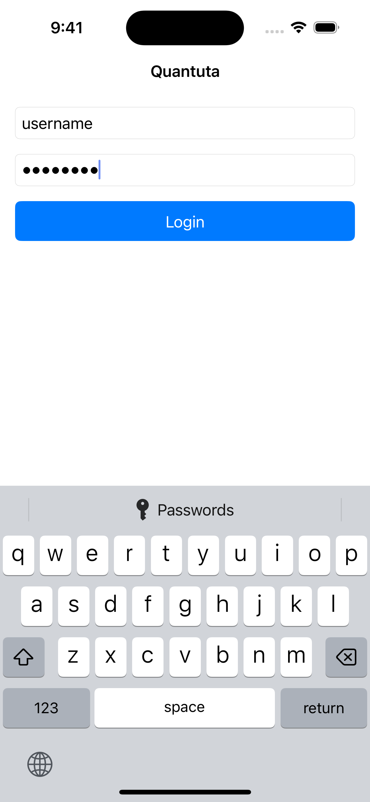
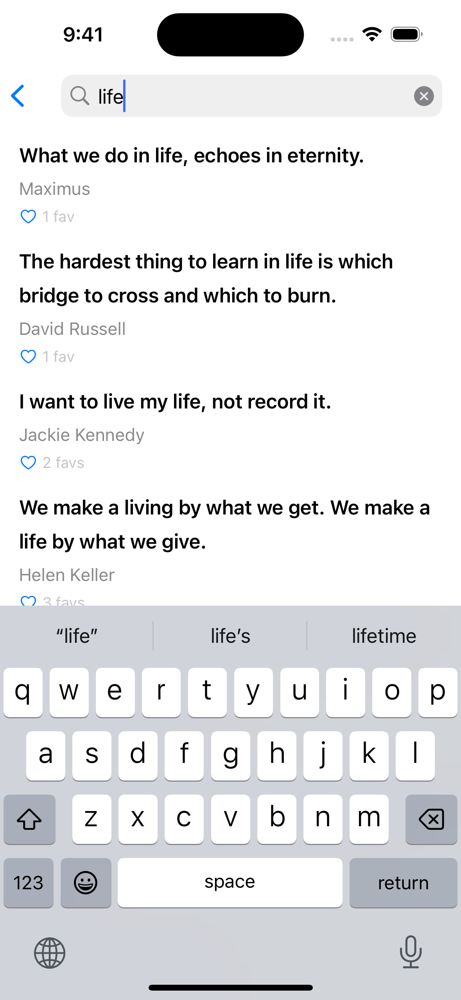

# Quantuta

**Quantuta** is an iOS application that uses **FavQs API**.

- Modular Architecture
- MVVM
- Swift
- UIKit
- Combine
- SnapKit
- Alamofire
- Modern Swift Concurrency
- XCTest

## Screenshots

|  |  |  |
|--|--|--|
